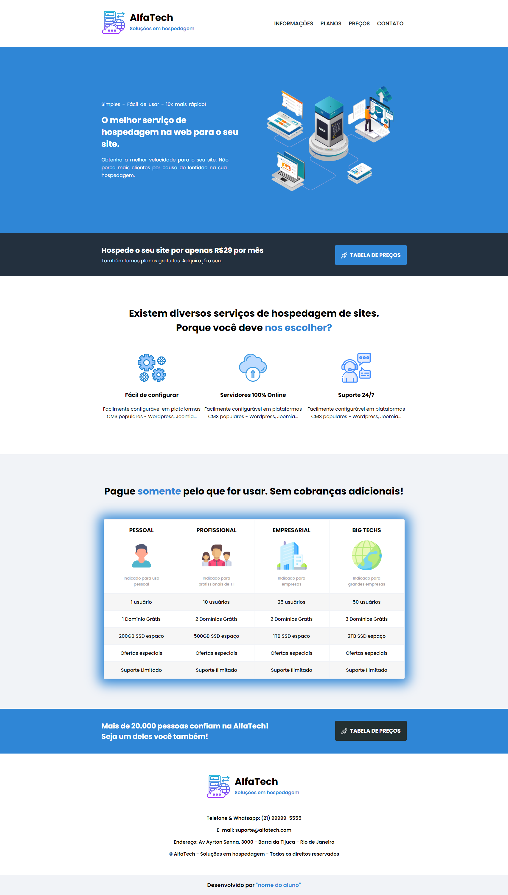
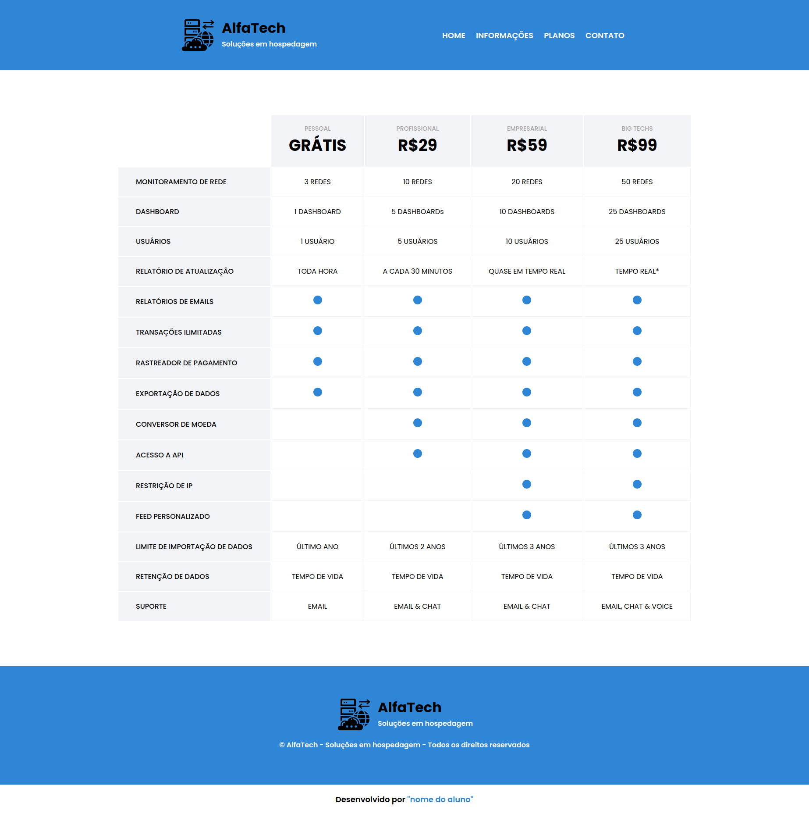

# 06ª Missão - Provedor de Hospedagem - DevMedia

A empresa **AlfaTech**, contratou a plataforma de cursos [DevMedia](https://www.devmedia.com.br/), para criar uma Página Web, que apresente o seu serviço de hospedagem aos seus clientes. Eu, como aluno Desenvolvedor da [DevMedia](https://www.devmedia.com.br/), fui designado para executar este projeto.

## Layout

A página de hospedagem da **AlfaTech**, vai possuír inicialmente duas páginas, sem responsividade e tags semântica.

* **Página Home**

* **Página Tabela de Preços**

## Projeto passo a passo

Nesta seção é apresentado o passo a passo a ser seguido, como guia para a criação da página de hospedagem da **AlfaTech**

Todos os 3 passos podem ser vistos clicando [aqui](https://www.devmedia.com.br/quest/?id=29), ou se preferir clicando de forma individual nos links abaixo:

* 01° passo - [Apresentação do Projeto](https://www.devmedia.com.br/quest/etapa.php?id=163)
* 02° passo - [Especificações](https://www.devmedia.com.br/quest/etapa.php?id=164)
* 03° passo - [Implementação](https://www.devmedia.com.br/quest/etapa.php?id=165)